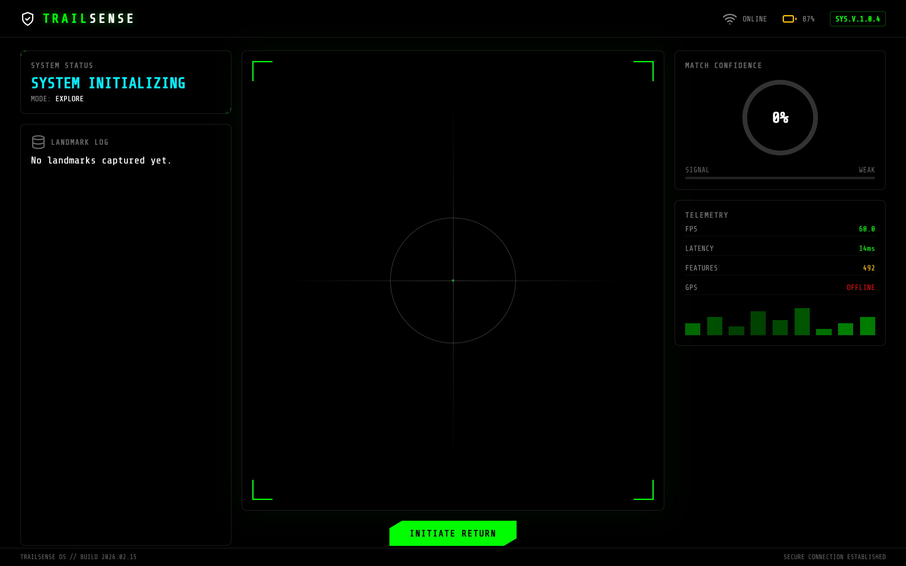

# TrailSense

Retrace your steps without GPS. TrailSense remembers where you have been by what it *looked* like,
and tells you whether you are still on the way back.

Built at MakeUofT 2026, where it won **[MLH] Best Use of Vultr**.
Project page: [devpost.com/software/trailsense-zit7ox](https://devpost.com/software/trailsense-zit7ox)


*Illustration of the wearable concept: a camera on the glasses frame feeding a small board worn at the temple.*



*The dashboard in EXPLORE mode, backend connected, before any landmark is captured. Captured on a
laptop with no camera attached, so the feed panel is empty; the telemetry tile on the right (FPS,
latency, feature count, battery) is static placeholder markup, not live measurement.*

## What it does

GPS fails in canyons, under canopy, and in disasters. Cellular fails with it, so cloud vision is not
an option either. TrailSense assumes all of that is gone and works anyway, because everything runs
on the device in your backpack.

It has two modes:

- **Explore** — as you walk out, the system grabs a frame every 2.5 seconds and stores it as a
  *visual landmark*: an ORB feature descriptor set, kept locally. A frame only qualifies if it
  yields more than 50 keypoints, so blank sky and featureless ground do not pollute the trail.
- **Return** — walking back, every incoming frame is matched against every stored landmark with a
  Hamming-distance brute-force matcher. The best match becomes a confidence score, and that score
  drives an LED on the device: **green** on track, **amber** uncertain, **red** off track.

The LED is the point. You should not have to stare at a phone to find your way back, so the primary
interface is a single coloured light. The web dashboard exists for setup and for watching what the
system sees — a live feature-overlay video feed, a landmark log, and the confidence meter — but the
system works with the screen off.

## How it is built

| Part | What it does |
|---|---|
| `backend/vision_core.py` | The engine. ORB extraction, landmark capture with a quality gate, RETURN-mode matching, confidence scoring and the state machine behind the LED |
| `backend/hardware.py` | Hardware abstraction. `ArduinoSerialHardware` drives the LED over serial with a one-byte protocol; `LocalHardware` logs instead, so the whole system runs on a laptop with no board attached |
| `backend/main.py` | FastAPI: an MJPEG stream of the processed feed, a status endpoint, mode switching, and runtime camera-source changes. Reconnects by itself when the camera drops |
| `frontend/` | React + Vite dashboard, polling status and rendering the feed. Reachable from a phone browser over the device's own WiFi |

**Stack:** Python, OpenCV (ORB + BFMatcher), FastAPI, pyserial; React, Vite, Framer Motion.
**Hardware:** Arduino Uno Q as the Linux brain, ESP32-CAM as the wireless eye, an LED on the serial
bridge.

## Running it

It runs on a laptop with no hardware at all — `hardware.py` falls back to a simulated LED, and the
camera source defaults to your webcam.

```bash
# backend
cd backend
pip install -r requirements.txt
python main.py                 # http://localhost:8000

# frontend, in a second terminal
cd frontend
npm install
npm run dev                    # http://localhost:5173
```

On Windows, `run.bat` does both.

To point it at an ESP32-CAM instead of the webcam, and to drive a real LED:

```bash
CAMERA_SOURCE="http://<esp32-ip>:81/stream" TRAILSENSE_HW="SERIAL" python3 main.py
```

`HARDWARE_SETUP.md` covers the board side — flashing the camera, wiring the LED, and what to change
if your board exposes GPIO rather than serial.

**One thing to know if you serve the dashboard to a phone:** use `npm run build` and serve the
static `dist/` output rather than leaving `npm run dev` running. The Vite dev server is a
development tool and is not meant to be reachable from other devices on the network; the built
output has no such caveat. On a trail this is mostly theoretical, but it costs nothing to do right.

## The part worth reading

`vision_core.py`, the `RETURN` branch. Everything interesting is in about forty lines: match the
current frame's descriptors against each stored landmark, keep the pairs under a Hamming distance
of 50, and turn the count into a 0–100 confidence that selects one of three LED colours. The
matching is a global scan over every landmark — fine for a trail's worth, and the comment in the
code marks where a constrained window search would go if it were not.

The confidence number is deliberately crude and should be read as "how strongly does this look like
somewhere I have been", not as a distance or a position. It is a hackathon prototype of visual place
recognition, not a SLAM system, and the code does not pretend otherwise.

## Credits

Built by a team of 2 at MakeUofT 2026. Released under the MIT License.
